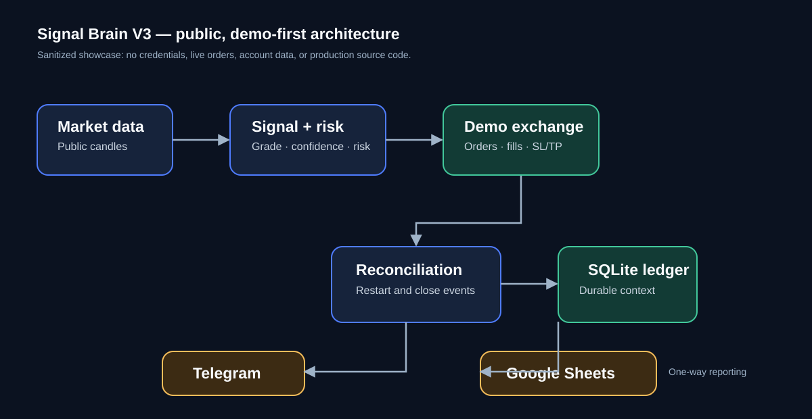

# Signal Brain V3 — Trading Automation & Reconciliation Showcase

A public, portfolio-safe engineering case study for Signal Brain V3: a Python
perpetual-futures automation prototype. The production source repository stays
private because it contains operational integrations, runtime state, and
debugging history.

This repository intentionally contains **no credentials, API keys, account
balances, order identifiers, production data, or exchange execution code**.



## Problem

API-driven trading workflows are vulnerable to operational drift: an order can
fill after a slow response, protective orders can change at the exchange, a
process can restart while a position remains open, and a reporting dashboard
can accidentally be treated as the source of truth.

## Solution

Signal Brain V3 separates responsibilities and makes data authority explicit:

```text
Public market data
  -> signal evaluation and risk checks
  -> demo exchange order lifecycle
  -> restart / close-event reconciliation
  -> durable audit ledger
  -> Telegram operations + Google Sheets reporting
```

## Engineering decisions

- **Exchange-first facts:** orders, fills, positions, and realized P&L come
  from the exchange; the application does not invent those values.
- **Durable strategy context:** SQLite retains grade, confidence, intended
  risk, and lifecycle metadata that an exchange order history does not carry.
- **Restart recovery:** startup re-reads exchange state and restores live
  protective-order management.
- **Safe reporting boundary:** Google Sheets is one-way and rebuildable from
  the ledger. A reporting failure cannot block reconciliation or protection.
- **Truthful performance labels:** complete records are separated from legacy
  partial records; estimates are visibly labelled instead of scored as facts.
- **Funding-aware accounting:** where returned by the exchange, funding is
  shown separately from realized P&L and included in an all-in figure.
- **Demo safety:** showcase workflows use a demo/VST environment; any
  potentially destructive diagnostics require an explicit acknowledgement.

## Technology

Python · SQLite · REST APIs · Binance public market data · BingX VST API ·
Telegram Bot API · Google Sheets API · Bash operational tooling · unittest ·
Streamlit

## Safe demonstration

`showcase_app.py` is a self-contained, read-only Streamlit visualization. It
uses fabricated sample data and performs no network calls, exchange actions, or
credential loading.

```bash
python -m venv .venv
.venv/bin/pip install -r requirements.txt
.venv/bin/streamlit run showcase_app.py
```

## Repository contents

| Path | Purpose |
| --- | --- |
| `showcase_app.py` | Interactive, read-only portfolio walkthrough |
| `docs/architecture.md` | Architecture, authority, and recovery details |
| `docs/system-overview.svg` | Sanitized architecture diagram |
| `PUBLIC_SCOPE.md` | What is intentionally excluded from this public repo |

## Scope

This is an automation and reliability case study, not investment advice, a
live-trading service, or a guarantee of financial performance.

## Repository policy

All rights reserved. No license is granted for reuse or redistribution without
the owner's written permission.
